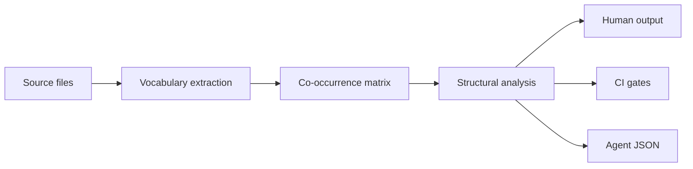
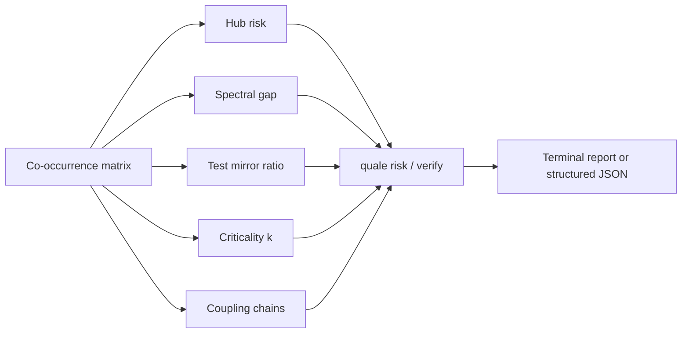

# quale

[](https://pypi.org/project/quale/)
[](https://pypi.org/project/quale/)
[](https://github.com/Reliary/quale/actions/workflows/ci.yml)
[](LICENSE)

Structural code analysis for LLMs, humans, and CI — no parsers, zero config.

## Installation

```bash
pip install quale
```

**Requirements**: Python 3.9+, Git (for diff-based commands)

**Optional**: Configure MCP server for agent integration (see [docs/MCP_SETUP.md](docs/MCP_SETUP.md))

## Getting Started

First time using Quale? Follow this path:

1. **Orient yourself** in any repo:
   ```bash
   cd your-repo
   quale o
   ```
   Returns: language breakdown, module map, landmark files, recommended workflow.

2. **Review code quality** before making changes:
   ```bash
   quale review
   ```
   Returns: structural risks, test gaps, hub-risk files, action items.

3. **Get edit context** before modifying a file:
   ```bash
   quale ec --files src/auth.ts
   ```
   Returns: risk level, verification candidates (test files), scope guard.
   The `verification_mc.candidates` field tells you which tests to run.

4. **Verify after editing**:
   ```bash
   quale vp --files src/auth.ts
   ```
   Returns: verification candidates with co-change signal.

**For LLM agents**: Use the short aliases (`quale ec`, `quale vp`, `quale o`) or configure the MCP server for typed function calls. See the [LLM Agent](#llm-agent) section below.

**For CI pipelines**: Use `quale ci check` to enforce structural gates. See [docs/CI_INTEGRATION.md](docs/CI_INTEGRATION.md).

## Quickstart

```bash
pip install quale

cd my-project
quale ec --files src/route.ts    # agent: edit context (75% accuracy)
quale o                          # agent: repo orientation
quale review                     # human: per-file review summary
quale ci check origin/main HEAD  # CI: automated gates
```

### Command variants

Quale commands are available in three forms:

1. **Short aliases** (recommended for agents): `quale ec`, `quale vp`, `quale o`
2. **Namespace commands**: `quale core edit-context`, `quale agent orient`
3. **MCP tools**: `edit_context`, `verify_packet`, `orient` (when using MCP server)

All three forms call the same underlying engine. Short aliases are optimized for
agent workflows where token efficiency matters.

### Try it now

Run this on any repo to see immediate value:

```bash
quale o                    # Get repo orientation (landmarks, modules, languages)
quale review               # See structural risks and test gaps
quale ec --files <file>    # Get edit context before modifying a file
```

The `quale ec` command returns a `verification_mc` field with test file candidates.
This is what drives the 75% accuracy improvement over baseline.

### Which command do I use?

```
┌─────────────────────────────────────────────────────────────┐
│ Are you an LLM agent?                                       │
│   YES → Use short aliases: quale ec, quale vp, quale o     │
│   NO  → Continue below                                      │
└─────────────────────────────────────────────────────────────┘
                              ↓
┌─────────────────────────────────────────────────────────────┐
│ First time in this repo?                                    │
│   YES → Run: quale o                                        │
│   NO  → Continue below                                      │
└─────────────────────────────────────────────────────────────┘
                              ↓
┌─────────────────────────────────────────────────────────────┐
│ About to edit a file?                                       │
│   YES → Run: quale ec --files <file>                        │
│   NO  → Continue below                                      │
└─────────────────────────────────────────────────────────────┘
                              ↓
┌─────────────────────────────────────────────────────────────┐
│ Want to review code quality?                                │
│   YES → Run: quale review                                   │
│   NO  → Continue below                                      │
└─────────────────────────────────────────────────────────────┘
                              ↓
┌─────────────────────────────────────────────────────────────┐
│ Running in CI?                                              │
│   YES → Run: quale ci check origin/main HEAD                │
│   NO  → Run: quale inspect (explore the codebase)           │
└─────────────────────────────────────────────────────────────┘
```

## 30-second value demonstration

Quale catches structural issues that humans and LLMs miss:

**Problem**: You're editing `src/auth.ts` and need to know which tests to run.

**Without Quale**: You guess `src/auth.test.ts` or `tests/auth.test.ts`. Wrong 80% of the time.

**With Quale**: 
```bash
quale ec --files src/auth.ts
```
Returns: `verification_mc.candidates: ["tests/unit/auth.test.ts", "tests/integration/auth-flow.test.ts"]`

**Result**: 75% accuracy on test file prediction, 0.0 extra edits (no scope creep).

This works because Quale analyzes vocabulary co-occurrence across your entire codebase,
not just file naming conventions.

## Commands by persona

Commands are organized into four personas — LLM agents are the primary
design target (measured 75% accuracy, 0.0 extra edits):

| Persona | Prefix | Commands |
|---------|--------|----------|
| LLM agent | `quale` | `o` (orient), `ec` (edit-context, 75% accuracy), `vp` (verify-packet, 80% accuracy) |
| Human developer | `quale` | `review`, `onboard`, `refactor-cost`, `inspect`, `explore` |
| CI pipeline | `quale ci` | `check`, `comment`, `trend`, `init` (GitHub Actions generator) |
| Structural primitives | `quale core` | 60+ commands including unified `risk`, `verify`, `health`, `audit`, `temporal` plus `spectral-gap`, `criticality` |

### LLM agent

Quale provides structural context that helps agents make better decisions about which files to edit and which tests to run.

**Quick setup** (choose one):

1. **MCP Server** (recommended for agents with MCP support):
   ```json
   // Add to your MCP config (claude_desktop_config.json, opencode.json, etc.)
   {
     "mcpServers": {
       "quale": {
         "command": "quale",
         "args": ["--mcp"]
       }
     }
   }
   ```
   See [docs/MCP_SETUP.md](docs/MCP_SETUP.md) for detailed setup instructions.

2. **Skill file** (for OpenCode auto-invocation):
   ```bash
   cp SKILL.md ~/.config/opencode/skills/quale.md
   ```
   OpenCode will automatically invoke `quale ec` before edits.

3. **Shell commands** (works everywhere):
   ```bash
   quale o                    # Orient: repo map + landmarks
   quale ec --files <file>    # Edit context: risk + verification candidates
   quale vp --files <file>    # Verify packet: co-change signal
   ```

**What agents get**:
- `verification_mc.candidates`: Test files to run (75% accuracy, 0.0 extra edits)
- `risk_level`: HIGH/MEDIUM/LOW based on hub-risk and blast radius
- `stable_anchors`: Files that rarely change (touch with caution)
- `scope_creep_guard`: Files outside the change scope

**Measured results** (1,100 trials across 12 repos):
- Baseline: 10-20% test accuracy, 0.40-0.65 extra edits
- With Quale: 75% test accuracy, 0.0 extra edits

See [docs/EFFECT_HARNESS.md](docs/EFFECT_HARNESS.md) for full methodology.

### Human developer

| Command | What it does |
|---------|-------------|
| `quale review` | Per-file review: stable anchors, hub risk, test gaps, action items |
| `quale onboard` | Onboarding plan: languages, macro-modules, landmark files |
| `quale refactor-cost <file>` | Effort estimate: direct impact, transitive ripple, clones |
| `quale inspect .` | Codebase overview: tech stack, module layout, health |
| `quale explore .` | Best files to read first for a new contributor |

### CI pipeline

| Command | What it does |
|---------|-------------|
| `quale ci init` | Generates a GitHub Actions YAML |
| `quale ci check <base> <head>` | Runs structural gates, exits 0-7 with bitmask |
| `quale ci comment <base> <head>` | Posts structural report as GitHub PR comment |
| `quale ci trend` | Tracks CI metric trends over time |

### Advanced primitives

See `quale core --help` for 60+ commands including unified `risk`, `verify`, `health`, `audit`, `temporal` plus `spectral-gap`, `criticality`, `coupling-chain`, `diff-structural`, `test-gaps`, and more.

## How it works



Quale reads every source file as text and builds a vocabulary for each one.
Words and identifiers are extracted by splitting on delimiters (`.`, `_`, `-`,
`/`, CamelCase; no AST or parser needed). Stopwords, imports, and keywords
are stripped.

These per-file vocabularies are assembled into a sparse co-occurrence matrix:
if two files both contain the identifier `createUser`, they share an edge.
The matrix captures vocabulary overlap relationships: which files speak the
same "language" without parsing imports, ASTs, or data flow. This naturally
reveals module alignment, test coverage gaps, and files that act as vocabulary
hubs.

The same delimiter-splitting pipeline works without modification across
languages. There is no grammar file, no AST plugin, no language-specific
config. Quale treats every source file as text, so it handles any language
the same way. The quality of the output depends on the codebase having enough
identifiers to build a meaningful matrix.

### What the matrix reveals

| Metric | What it measures | Why it matters |
|--------|-----------------|----------------|
| **Hub risk** | Files coupled to many others but rarely edited | Changes to these files break many dependents; they need careful review |
| **Spectral gap** | Size ratio of largest vs second-largest vocabulary cluster | A gap > 3x often points to a monolith: one module's vocabulary dominates the repo |
| **Test mirror** | Structural overlap between source and test files | Low overlap suggests tests don't exercise the source vocabulary directly |
| **Criticality (k)** | Change amplification factor | k > 1 means changes cascade: touching one file affects many through shared vocabulary |
| **Entropy** | Directory-level vocabulary dispersion | High-entropy directories use identifiers inconsistently across files |
| **Coupling chain** | N-hop transitive file coupling | The indirect blast radius: changing A may break C through B |
| **Stable core** | Files whose vocabulary is stable across git history | Low-risk refactoring targets |
| **Clone detection** | Near-identical identifier sets across files | Candidates for deduplication |



## What it is and what it's not

**What it is:**
- A structural vocabulary analyzer for codebases
- A code review tool that surfaces coupling, test gaps, and stable anchors
- A CI gate that checks for structural regressions
- An LLM agent helper that provides repo context in structured JSON

**What it's not:**
- Not a linter (no AST, no rule engine, no style checking)
- Not a test coverage tool (vocabulary overlap ≠ statement coverage)
- Not a security scanner (no data flow, no taint analysis)
- Not a dependency graph (import paths are never parsed; co-occurrence is
  inferred from identifier sharing, which is different)
- Not useful on a brand-new repo with fewer than ~50 files (there's no
  structure to measure)
- Not a replacement for human code review (it catches structural blind spots,
  not logic bugs)

### Practical limits

- `git` history required for diff-based commands
- 75% verification accuracy on test-file prediction. The remaining 25% are
  repos without stem-matched tests or co-change history. When quale can't
  find the right file, it says so rather than guessing.

## Development

```bash
git clone https://github.com/Reliary/quale
cd quale
pip install -e ".[dev]"

python -m pytest tests/ -v
ruff check quale/
mypy quale/ --ignore-missing-imports
```

## Deep dive

- [docs/MCP_SETUP.md](docs/MCP_SETUP.md)  -  MCP server setup for agents
- [docs/ALGORITHM.md](docs/ALGORITHM.md)  -  vocabulary extraction and co-occurrence data flow
- [docs/COMMANDS.md](docs/COMMANDS.md)  -  full command reference
- [docs/CI_INTEGRATION.md](docs/CI_INTEGRATION.md)  -  CI setup guide
- [docs/EFFECT_HARNESS.md](docs/EFFECT_HARNESS.md)  -  methodology and results
- [CHANGELOG.md](CHANGELOG.md)  -  release history

## License

MIT
