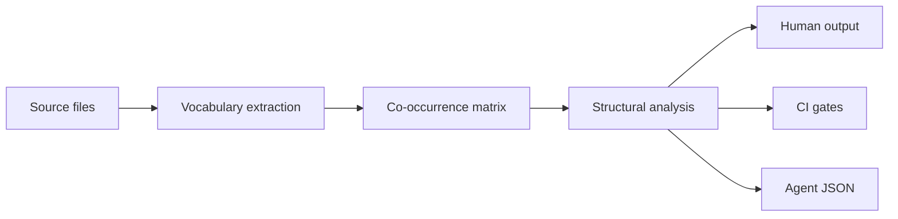
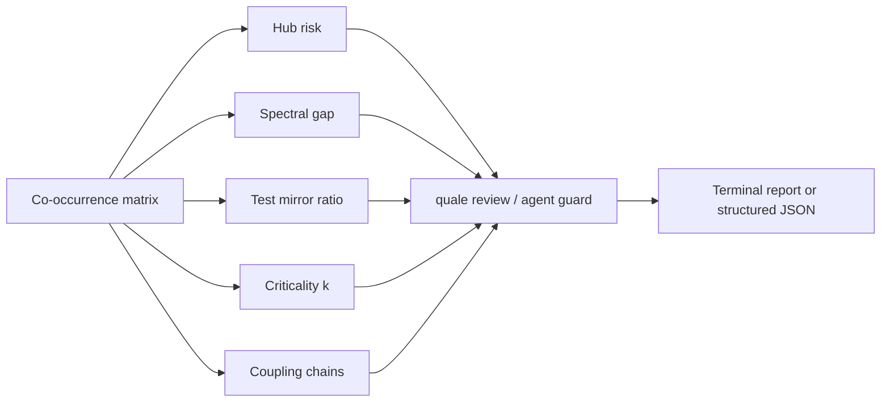

# quale

[](https://pypi.org/project/quale/)
[](https://pypi.org/project/quale/)
[](https://github.com/Reliary/quale/actions/workflows/ci.yml)
[](LICENSE)

Structural codebase analysis — no parsers, no config, any language.

## Quickstart

```bash
pip install quale

cd my-project
quale review                     # per-file review summary
quale ci check origin/main HEAD  # automated CI gates
quale agent guard src/route.ts   # risk packet for LLM agents
```

## Commands by persona

Commands are organized into four namespaces:

| Persona | Prefix | Commands |
|---------|--------|----------|
| Human developer | `quale` | `review`, `onboard`, `refactor-cost`, `inspect`, `explore` |
| LLM agent | `quale agent` | `orient` (repo map), `edit` (edit context), `guard` (risk packet) |
| CI pipeline | `quale ci` | `check`, `comment`, `trend`, `init` (GitHub Actions generator) |
| Structural primitives | `quale core` | 60+ commands including `hub-risk`, `spectral-gap`, `criticality` |

### Human developer

| Command | What it does |
|---------|-------------|
| `quale review` | Per-file review: stable anchors, hub risk, test gaps, action items |
| `quale onboard` | Onboarding plan: languages, macro-modules, landmark files |
| `quale refactor-cost <file>` | Effort estimate: direct impact, transitive ripple, clones |
| `quale inspect .` | Codebase overview: tech stack, module layout, health |
| `quale explore .` | Best files to read first for a new contributor |

### LLM agent

Agent commands return structured JSON — no terminal output to parse:

| Command | What it returns |
|---------|----------------|
| `quale agent orient` | Repo map: modules, landmarks, languages, recommended workflow |
| `quale agent edit <file>` | Edit context + `verification_mc` multi-choice candidates |
| `quale agent guard <file>` | Risk packet: guide, hub risk, complexity, stable anchors |

Agents are onboarded through `agent orient`, which returns enough structural
context to avoid wrong-file-path and wrong-test-file mistakes.

**Measured effect on a deepseek-v4-flash agent (1,100 trials, 12 repos):**
baseline test-file accuracy 10-20%, `edit-context --format tool` raises it to
75% with zero extra edits. Across 6 models tested (Qwen, Gemma, Nemotron,
Mistral, Claude, local Gemma), every model guessed the wrong test file
without quale and found the right one with it.

### CI pipeline

| Command | What it does |
|---------|-------------|
| `quale ci init` | Generates a GitHub Actions YAML |
| `quale ci check <base> <head>` | Runs structural gates, exits 0-7 with bitmask |
| `quale ci comment <base> <head>` | Posts structural report as GitHub PR comment |
| `quale ci trend` | Tracks CI metric trends over time |

### Advanced primitives

See `quale core --help` for 60+ commands including `hub-risk`, `spectral-gap`,
`criticality`, `coupling-chain`, `diff-structural`, `test-gaps`, and more.

## How it works



Quale reads every source file as text and builds a vocabulary for each one.
Words and identifiers are extracted by splitting on delimiters (`.` `_` `-`
`/` CamelCase — no AST or parser needed). Stopwords, imports, and keywords
are stripped.

These per-file vocabularies are assembled into a sparse co-occurrence matrix:
if two files both contain the identifier `createUser`, they share an edge.
The matrix captures vocabulary overlap relationships: which files speak the
same "language" — without parsing imports, ASTs, or data flow. This naturally
reveals module alignment, test coverage gaps, and files that act as vocabulary
hubs.

The same delimiter-splitting pipeline works without modification across
languages — there is no grammar file, no AST plugin, no language-specific
config. Quale treats every source file as text, so it handles any language
the same way. The quality of the output depends on the codebase having enough
identifiers to build a meaningful matrix.

### What the matrix reveals

| Metric | What it measures | Why it matters |
|--------|-----------------|----------------|
| **Hub risk** | Files coupled to many others but rarely edited | Changes to these files break many dependents; they need careful review |
| **Spectral gap** | Size ratio of largest vs second-largest vocabulary cluster | A gap > 3x often points to a monolith — one module's vocabulary dominates the repo |
| **Test mirror** | Structural overlap between source and test files | Low overlap suggests tests don't exercise the source vocabulary directly |
| **Criticality (k)** | Change amplification factor | k > 1 means changes cascade — touching one file affects many through shared vocabulary |
| **Entropy** | Directory-level vocabulary dispersion | High-entropy directories use identifiers inconsistently across files |
| **Coupling chain** | N-hop transitive file coupling | The indirect blast radius — changing A may break C through B |
| **Stable core** | Files whose vocabulary is stable across git history | Low-risk refactoring targets |
| **Clone detection** | Near-identical identifier sets across files | Candidates for deduplication |



## What it is and what it's not

**What it is:**
- A structural vocabulary analyzer for codebases
- A code review tool that surfaces coupling, test gaps, and stable anchors
- A CI gate that checks for structural regressions
- An LLM agent helper that provides repo context in structured JSON

**What it's not:**
- Not a linter (no AST, no rule engine, no style checking)
- Not a test coverage tool (vocabulary overlap ≠ statement coverage)
- Not a security scanner (no data flow, no taint analysis)
- Not a dependency graph (import paths are never parsed — co-occurrence is
  inferred from identifier sharing, which is different)
- Not useful on a brand-new repo with fewer than ~50 files — there's no
  structure to measure
- Not a replacement for human code review — it catches structural blind spots,
  not logic bugs

### Practical limits

- `git` history required for diff-based commands
- 75% verification accuracy on test-file prediction — the remaining 25% are
  repos without stem-matched tests or co-change history. When quale can't
  find the right file, it says so rather than guessing.

## Development

```bash
git clone https://github.com/Reliary/quale
cd quale
pip install -e ".[dev]"

python -m pytest tests/ -v
ruff check quale/
mypy quale/ --ignore-missing-imports
```

## Deep dive

- [docs/ALGORITHM.md](docs/ALGORITHM.md) — vocabulary extraction and co-occurrence data flow
- [docs/COMMANDS.md](docs/COMMANDS.md) — full command reference
- [docs/CI_INTEGRATION.md](docs/CI_INTEGRATION.md) — CI setup guide
- [docs/EFFECT_HARNESS.md](docs/EFFECT_HARNESS.md) — methodology and results
- [CHANGELOG.md](CHANGELOG.md) — release history

## License

MIT
