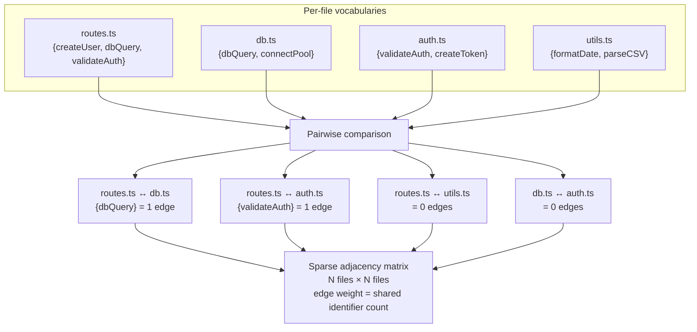
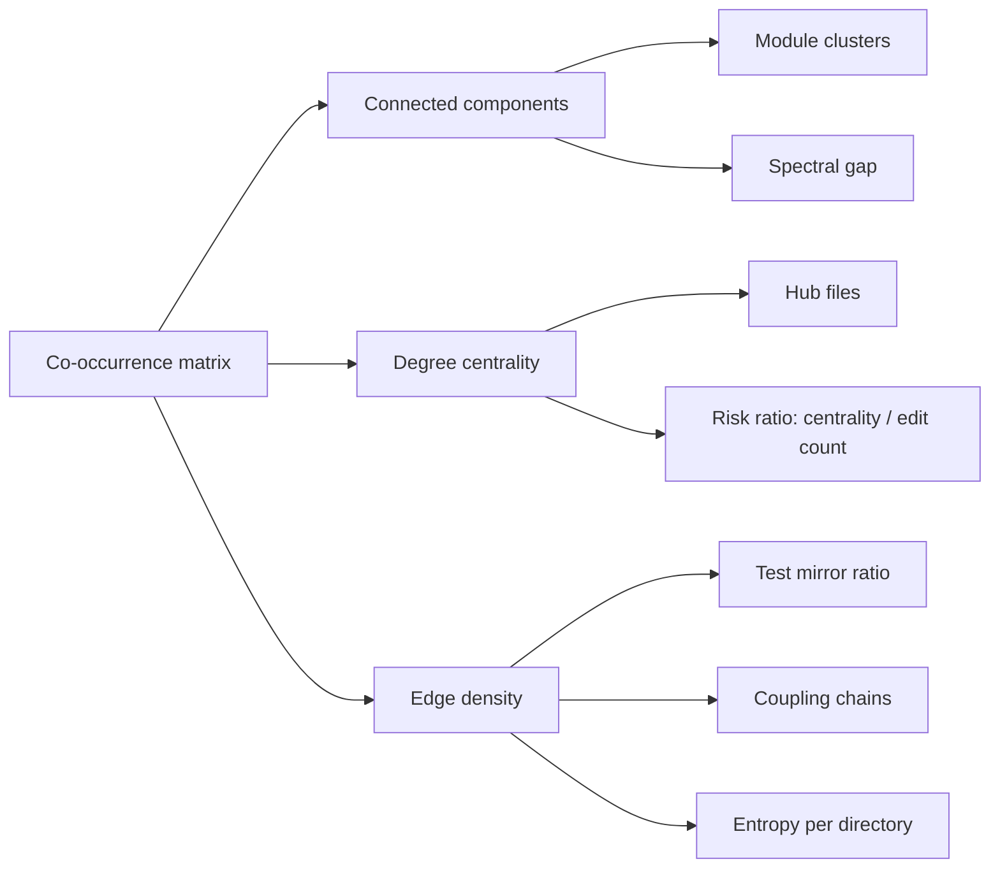

# Algorithm

This document gives a visual and conceptual overview of how quale reads your
codebase and produces structural metrics.

## 1. Vocabulary extraction

Each source file is reduced to a vocabulary — the set of identifiers and words
it uses, with frequencies.

```mermaid
flowchart LR
    A["src/routes.ts"] --> B["Split on delimiters<br/>( . _ - / $ CamelCase )"]
    B --> C["Filter tokens<br/>- min length 4<br/>- alpha-only<br/>- skip imports<br/>- skip keywords<br/>- skip literals"]
    C --> D[{"identifier: count"}]
    D --> E["createUser: 3<br/>validateAuth: 2<br/>dbQuery: 1<br/>formatDate: 2<br/>..."]
```

Every file in the repo goes through the same pipeline, regardless of language.
No AST construction, no grammar file, no language-specific logic. The
delimiter split handles SnakeCase, kebab-case, dot.notation, and CamelCase
in one pass.

### Filtering rules

| Rule | Reason |
|------|--------|
| Min 4 characters | Single-letter loop variables and two-letter abbreviations are noise — they co-occur accidentally across unrelated files |
| Alpha only | Numbers and symbols (`v2`, `$emit`) are rarely structural identifiers |
| Skip imports | `from x import y` / `use crate::y` — standard library paths are present in every file and add zero structural signal |
| Skip keywords | `return`, `if`, `class`, `struct`, `fn`, `def` — present in every file of a given language, contribute nothing |

## 2. Co-occurrence matrix

Vocabularies are compared pairwise across all files. If two files both contain
the same identifier, they share an edge.



This is the core data structure from which every quale metric derives. It is
always sparse — real codebases have ~2-15% density because most files are
structurally independent.

### What the matrix captures

| Structural property | How it appears in the matrix |
|---|---|
| **Module boundary** | Files in the same directory share many identifiers; cross-directory edges are sparse. The matrix naturally clusters by directory. |
| **Test mirror** | A source file and its test file share identifiers (`createUser` appears in both `handler.go` and `handler_test.go`). High overlap = well-tested vocabulary. |
| **Hub file** | A file with edges to many otherwise-unconnected files. Touches vocabulary used across the whole repo. |
| **Isolated file** | Zero or near-zero edges — utility files, config files, generated code. |
| **Stable core** | Files whose identifier set changes little across git history. Low churn, high centrality. |

## 3. Structural metrics



### PMI (Pointwise Mutual Information)

Once the matrix is built, quale can compute how surprising a co-occurrence is.
If two identifiers almost always appear together, that's not useful — PMI
discounts high-frequency pairs and surfaces genuinely interesting ones.

$$PMI(a, b) = \log_2 \frac{P(a,b)}{P(a)P(b)}$$

PMI calibration converts raw co-occurrence counts into signal. A pair with
count=100 but where each identifier appears in 95% of files gets a low PMI
score. A pair with count=5 but each appears in only 2% of files gets a high
score.

## 4. Output generation

The matrix and derived metrics are rendered according to the persona:

| Persona | Format | Example |
|---------|--------|---------|
| Human developer | Colored terminal output | `quale review` shows per-file risks with icons and explanations |
| CI pipeline | Exit codes + PR comment | `quale ci check` exits 0-7, `quale ci comment` posts markdown |
| LLM agent | Structured JSON | `quale ec` returns 21-key contract with `verification_mc` |

All three output formats derive from the same matrix — there is no separate
analysis path for different consumers.

## Further reading

- [README.md](../README.md) — quickstart and command reference
- [COMMANDS.md](COMMANDS.md) — full command reference
- [EFFECT_HARNESS.md](EFFECT_HARNESS.md) — methodology and empirical results
